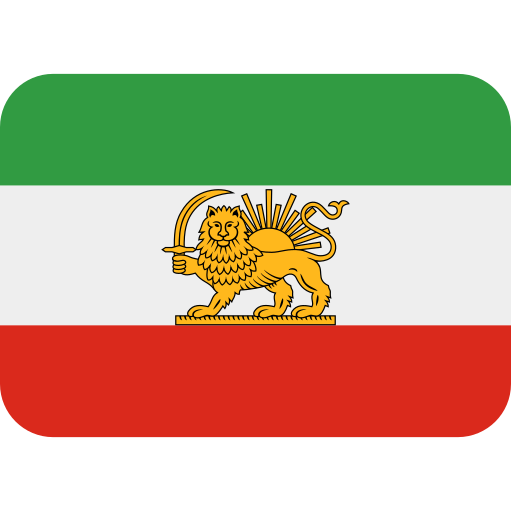

‍‍`فارسی | Persian`

# ZCalendar 🗓️

**یک تقویم هجری شمسی (جلالی) برای لینوکس، با تمرکز بر کاربران فارسی زبان**

ZCalendar یک پروژه ی متن باز و در حال توسعه است که هدف اون ساخت یک تقویم ساده، زیبا و بومی برای دسکتاپ لینوکسه.

این پروژه با **Rust و GTK4** ساخته میشه و در حال حاضر تمرکز اصلی اون نمایش تقویم هجری شمسی با رابط کاربری فارسیه.

---

## 🎯 هدف پروژه

ایده ی ZCalendar از یک سؤال ساده شروع شد:

> چرا برای کاربران فارسی زبان لینوکس، یک تقویم دسکتاپ ساده و بومی نداشته باشیم؟

تقویم هجری شمسی بخش مهمی از زندگی روزمره ی فارسی زبانان، به خصوص در ایرانه. با این حال، تجربه ی استفاده از یک تقویم شمسی مناسب در محیط دسکتاپ لینوکس میتونه بهتر و بومی تر باشه.

هدف ZCalendar اینه که به مرور تبدیل بشه به یک برنامه ی کامل برای مدیریت تاریخ و زمان در محیط لینوکس؛ برنامه‌ای که از ابتدا با نیاز های کاربران فارسی زبان طراحی شده باشه.

---

## ✨ وضعیت فعلی

پروژه هنوز در مراحل اولیه ی توسعه قرار داره اما نسخه‌ی فعلی قابلیت های پایه رو داره:

* 📅 نمایش تقویم هجری شمسی
*  رابط کاربری فارسی
* 🗓️ نمایش روزهای ماه
* 🔵 مشخص کردن روز جاری
* ◀️ رفتن به ماه قبل
* ▶️ رفتن به ماه بعد
* 🔤 پشتیبانی از فونت فارسی
* 🦀 ساخته شده با Rust
* 🖥️ رابط گرافیکی با GTK4

این پروژه هنوز کامل نیست و قابلیت های بیشتری در آینده به اون اضافه خواهد شد.

---

## 🛠️ تکنولوژی ها

ZCalendar در حال حاضر با استفاده از این تکنولوژی ها ساخته میشه:

* **Rust** — زبان اصلی پروژه
* **GTK4** — رابط کاربری
* **Libadwaita** — برای سازگاری بهتر با محیط دسکتاپ لینوکس
* **jalali-calendar** — برای محاسبات و تبدیل تاریخ های هجری شمسی

یکی از اهداف آینده ی پروژه اینه که بخش مربوط به تقویم و محاسبات تاریخ به صورت مستقل توسعه داده بشه.

---

## 🚀 برنامه ی آینده

ZCalendar قرار نیست فقط یک نمایش دهنده‌ی ساده ی تاریخ باقی بمونه.

برخی از قابلیت هایی که ممکنه در آینده به پروژه اضافه بشن:

* 📅 انتخاب روز
* 🕌 نمایش تعطیلات رسمی
*  مناسبت های ایرانی
* 🔔 یادآوری رویداد ها
* 📝 ثبت رویداد و یادداشت برای روزها
* 🔄 تبدیل تاریخ شمسی، میلادی و قمری
* 🖥️ پشتیبانی بهتر از محیط‌های مختلف دسکتاپ لینوکس
* 📌 قابلیت اجرا در System Tray
* 🎨 شخصی سازی ظاهر
* 🌙 حالت تاریک
* 📦 بسته های قابل نصب برای توزیع های مختلف لینوکس

این فهرست قطعی نیست و با پیشرفت پروژه ممکنه تغییر کنه.

---

## 🤝 چطور میتونید کمک کنید؟

ZCalendar یک پروژه ی متن باز هست و برای بهتر شدن اون به مشارکت کاربران نیاز داره.

حتی اگر برنامه‌نویس نیستید، میتونید کمک کنید.

### 🐛 گزارش باگ

اگر مشکلی پیدا کردید، یک **Issue** ایجاد کنید و توضیح بدید:

* چه اتفاقی افتاد؟
* انتظار داشتید چه اتفاقی بیفتد؟
* از چه توزیع لینوکسی استفاده می‌کنید؟
* نسخه‌ی ZCalendar چه بوده است؟

اگر امکانش را دارید، اضافه کردن Screenshot یا خروجی خطا هم بسیار کمک‌کننده است.

### 💡 پیشنهاد قابلیت

اگر ایده‌ای برای بهتر شدن ZCalendar دارید، آن را در Issues مطرح کنید.

مثلاً:

> «امکان نمایش تعطیلات رسمی اضافه شود.»

یا:

> «امکان تغییر ماه با کلید های کیبورد اضافه شود.»

### 💻 مشارکت در کد

اگر Rust یا GTK4 بلد هستید، میتونید در توسعه ی پروژه مشارکت کنید.

Pull Request ها با کمال میل پذیرفته میشن. ❤️

---

## 👨‍💻 درباره ی سازنده

سلام! من **Mobin** هستم، یک برنامه‌نویس و دانش آموز علاقه‌مند به ساخت نرم افزار و یادگیری تکنولوژی های مختلف.

ZCalendar رو در کنار یادگیری **Rust و GTK4** شروع کردم تا هم یک تکنولوژی جدید یاد بگیرم و هم چیزی بسازم که واقعاً برای بخشی از کاربران لینوکس کاربرد داشته باشه.

این پروژه قرار نیست از ابتدا یک محصول بزرگ و کامل باشه؛ هدف اینه که **قدم به قدم ساخته شود، استفاده بشه و با کمک جامعه بهتر بشه.**

---

## 📌 وضعیت پروژه

> 🚧 **ZCalendar در حال توسعه است.**

ممکنه بعضی قسمت ها ناقص باشن یا در نسخه های آینده تغییر کنن.

اگر ایده ای دارید یا مشکلی پیدا کردید، خوشحال میشم اون رو با من و دیگر مشارکت کنندگان پروژه در میان بذارید.

---

## ❤️ مشارکت کنید

اگر ایده ی ZCalendar برایتان جالب است:

⭐ به پروژه Star بدهید
🐛 باگ‌ها رو گزارش کنید
💡 پیشنهاد بدهید
💻 در توسعه مشارکت کنید
📢 پروژه رو به دوستان لینوکسی و فارسی زبان خود معرفی کنید

حتی یک **Star** یا یک گزارش باگ کوچک میتونه به دیده شدن پروژه و ادامه ی توسعه‌ی اون کمک کنه.

---

## 📄 License

این پروژه متن بازه و تحت مجوز **MIT** منتشر خواهد شد.
